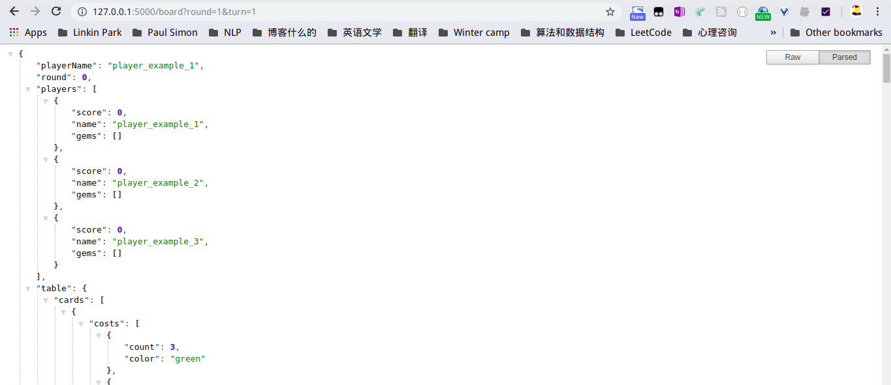

建议git clone repo，不然可能会有点麻烦（

# 在PyCharm上安装和运行

（大概）

1. 将当前文件夹作为项目导入（应该会自动识别为Flask？）
2. 添加virtualenv环境（如果没有自动添加）
3. 点绿色箭头运行或在Terminal中执行`python api.py`
4. 在浏览器中输入`http://127.0.0.1:5000/board?round=1&turn=1`查看结果

如果安装对了，浏览器就会返回`output/board_round_turn_1.json`，如下图。

